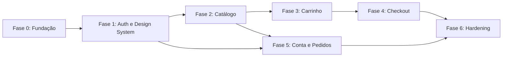

# Plano de Implementação do Frontend v2 — shop-api

## 1. Resultado esperado

Entregar uma SPA React em `/frontend`, integrada à API v1, com as jornadas do MVP definidas em `frontend-specification-v2.md`, identidade visual derivada de `docs/ideacao` e qualidade suficiente para evolução incremental.

O projeto é greenfield: o diretório `/frontend` está vazio. O trabalho será organizado por vertical slices, mantendo infraestrutura compartilhada pequena e dependências entre features explícitas.

## 2. Restrições e fontes

- `openapi.yaml` é a autoridade para integração.
- `docs/ideacao` é a autoridade visual.
- As especificações anteriores não devem orientar decisões desta implementação.
- Não serão criados mocks permanentes para encobrir funcionalidades ausentes no backend.
- Backend e frontend permanecem como trilhas separadas. O MVP não prevê alteração de contrato do backend.

## 3. Arquitetura proposta

```text
frontend/
├── public/
├── src/
│   ├── app/
│   │   ├── providers/
│   │   ├── router/
│   │   ├── layouts/
│   │   └── styles/
│   ├── features/
│   │   ├── auth/
│   │   ├── customer/
│   │   ├── catalog/
│   │   ├── cart/
│   │   ├── checkout/
│   │   └── orders/
│   ├── shared/
│   │   ├── api/
│   │   ├── components/
│   │   ├── contracts/
│   │   ├── formatting/
│   │   ├── hooks/
│   │   ├── testing/
│   │   └── types/
│   ├── main.tsx
│   └── vite-env.d.ts
├── e2e/
├── package.json
└── vite.config.ts
```

### 3.1 Regras de dependência

- `app` compõe providers, layouts e rotas; não contém regra de feature.
- `features` organizam página, componentes, hooks, schemas, queries e mutations do próprio domínio.
- Uma feature não importa internals de outra; integrações passam por uma interface pública pequena e explícita.
- `shared` contém somente elementos realmente reutilizados por duas ou mais features.
- Não usar barrel files globais; preferir imports diretos e caminhos estaticamente analisáveis.
- Componentes de página coordenam dados; componentes visuais recebem props simples e não conhecem HTTP.

## 4. Decisões técnicas

### 4.1 Ferramentas

| Área | Escolha | Responsabilidade |
|---|---|---|
| Build | Vite + TypeScript | SPA, desenvolvimento e build |
| UI | React + Tailwind CSS v4 | Componentes e design tokens |
| Rotas | React Router | URLs, proteção e lazy loading |
| Formulários | React Hook Form + Zod | Estado, validação e mensagens |
| Estado remoto | TanStack Query | Cache, deduplicação, invalidação e retries de leitura |
| Estado local | Zustand | Sessão mínima e metadados locais do carrinho |
| Testes | Vitest + Testing Library + MSW | Unidade, componentes e integração |
| E2E | Playwright | Jornadas críticas no navegador |

### 4.2 Propriedade do estado

| Estado | Dono | Persistência |
|---|---|---|
| Token e identidade mínima | Zustand `authStore` | `sessionStorage` ou `localStorage` |
| `carrinhoId` por cliente | Zustand `cartSessionStore` | `localStorage` versionado |
| Catálogo, categorias e detalhes | TanStack Query | Memória |
| Carrinho e pedidos | TanStack Query | Memória; servidor é autoridade |
| Busca, categoria, período e paginação | URL | Histórico do navegador |
| Campos de formulário | React Hook Form | Nenhuma |
| Menu, dialog e toast | Estado local/contexto leve | Nenhuma |

Zustand não armazenará cópias de catálogos, pedidos, perfil ou carrinho completo.

### 4.3 Fronteira HTTP

1. `apiClient` monta URL, headers e `AbortSignal`.
2. O transport retorna JSON desconhecido.
3. Um schema Zod valida envelope e payload.
4. Um adapter normaliza IDs e números aceitos como `number | string`.
5. A feature recebe um modelo previsível e independente das ambiguidades de serialização.

O cliente normaliza todos os erros para:

```ts
type AppError = {
  kind: 'unauthorized' | 'not-found' | 'conflict' | 'validation' | 'network' | 'server' | 'contract';
  code?: string;
  message: string;
  fieldErrors?: Record<string, string[]>;
  status?: number;
};
```

### 4.4 Estratégia de autenticação

- O token é anexado somente às rotas protegidas.
- `expiraEm` é verificado na inicialização e antes de mutations protegidas.
- A opção de permanência escolhe `localStorage` ou `sessionStorage`.
- Não haverá refresh silencioso, pois a API não expõe refresh token.
- `401` encerra a sessão e conserva apenas um `returnTo` interno.
- Logout remoto é tentado antes da limpeza, sem impedir a limpeza local.
- Mudança de `clienteId` remove o vínculo de carrinho do usuário anterior da memória ativa.

### 4.5 Estratégia de carrinho

O OpenAPI não oferece “carrinho atual”. Portanto:

1. O primeiro “Adicionar” autenticado procura um `carrinhoId` local associado ao `clienteId`.
2. Sem ID, chama `POST /carrinho/criar` sem body e persiste o retorno.
3. Adiciona o item com o último preço validado do produto.
4. Com ID conhecido, `GET /carrinho/{id}` reidrata o carrinho.
5. `404` ao reidratar remove somente aquele ID local e permite criar um novo carrinho na próxima inclusão.
6. Logout não apaga o vínculo persistido do próprio cliente, permitindo retomada após novo login; cancelamento da conta e pedido criado removem o vínculo.

Como `CarrinhoItemResponse` não possui dados visuais, os `produtoId` únicos serão resolvidos em paralelo. O cache do catálogo/detalhe deve ser reutilizado antes de disparar chamadas.

### 4.6 Estratégia de pedidos

- A lista depende do CPF do perfil. Perfil e pedidos devem ser encadeados apenas onde existe dependência real.
- Totais serão derivados dos itens; não serão persistidos como estado adicional.
- O detalhe reutiliza cache de produtos e hidrata IDs restantes em paralelo.
- Cancelamento envia somente `Cancelado`; a API decide se o estado permite a transição.
- Após mutação, invalidar detalhe e lista do cliente.

## 5. Design system e composição

### 5.1 Fundação

- Converter a paleta `brand` e `ink` do protótipo em tokens Tailwind v4.
- Configurar Inter com fallback de sistema e carregamento que não bloqueie conteúdo crítico.
- Criar estilos globais de seleção, foco, scrollbar, superfície e textura do hero.
- Respeitar `prefers-reduced-motion`.

### 5.2 Componentes base

- `Button`, `IconButton`, `LinkButton`.
- `Input`, `Checkbox`, `Select`, `FieldError`, `FormErrorSummary`.
- `Card`, `Surface`, `Badge`, `Chip`.
- `Dialog`, `DropdownMenu`, `Toast`, `InlineAlert`.
- `QuantityInput`, `Pagination`, `Skeleton`, `EmptyState`, `ErrorState`.
- `ProductImage` com fallback e texto alternativo.

Variantes devem usar props semânticas (`variant`, `size`, `status`) em vez de combinações crescentes de booleanos.

### 5.3 Shell

- `StoreLayout`: header, conteúdo e footer.
- `AccountLayout`: shell da loja mais navegação secundária da conta.
- Header responsivo com busca, categoria, carrinho e menu autenticado.
- Footer apenas com informações e links que possuam destino válido no MVP.

## 6. Fases de entrega

### Fase 0 — Fundação e contrato

Objetivo: tornar o projeto executável, tipado, testável e conectado à API sem implementar jornadas completas.

Entregas:

- Scaffold Vite/React/TypeScript.
- Tailwind v4 e tokens do protótipo.
- ESLint, formatação, typecheck e scripts de CI.
- Vitest, Testing Library, MSW e Playwright.
- Variáveis de ambiente validadas.
- Schemas Zod, adapters, envelopes e erro normalizado.
- `apiClient`, QueryClient e providers.
- Router e shells iniciais.

Saída: build e testes smoke passam; uma consulta simulada valida a fronteira HTTP.

### Fase 1 — Design system e autenticação

Objetivo: concluir o shell reutilizável e liberar acesso seguro às áreas protegidas.

Entregas:

- Componentes base e estados comuns.
- Header, footer, menu do cliente e navegação responsiva.
- Store de autenticação versionada.
- Login, sessão, expiração, proteção de rota e logout.
- Cadastro completo.
- Página 404.

Saída: usuário cadastra, entra, atualiza a página, acessa rota protegida e sai.

### Fase 2 — Catálogo e produto

Objetivo: entregar a descoberta pública de produtos.

Entregas:

- Query de categorias e catálogo iniciadas em paralelo.
- URL como fonte de busca, categoria e página.
- Cards, grid, paginação, vazios e erros.
- Detalhe do produto com quantidade e disponibilidade.
- Guard de login ao adicionar.

Saída: visitante navega e busca sem conteúdo fictício; tentativa de compra exige login.

### Fase 3 — Carrinho

Objetivo: manter carrinho remoto coerente para o cliente autenticado.

Entregas:

- Persistência mínima de `carrinhoId` por cliente.
- Orquestração criar → adicionar.
- Consulta e hidratação paralela de produtos.
- Atualização, remoção, rollback e badge.
- Tela de carrinho e resumo sem frete/desconto.

Saída: carrinho sobrevive a reload e novo login no mesmo navegador enquanto o ID permanecer válido.

### Fase 4 — Checkout

Objetivo: converter um carrinho válido em pedido.

Entregas:

- Pré-carga do perfil/endereço.
- Formulário de entrega e pagamento.
- Montagem estrita de `CreatePedidoRequest`.
- Proteção contra envio duplicado.
- Confirmação e limpeza/invalidação de estado.

Saída: pedido é criado sem enviar `clienteId` ou `carrinhoId`.

### Fase 5 — Conta e pedidos

Objetivo: concluir o autosserviço pós-compra e de perfil.

Entregas:

- Consulta e edição de dados.
- Troca de senha.
- Cancelamento de conta.
- Lista paginada de pedidos por CPF e período.
- Detalhe com hidratação de produtos.
- Cancelamento de pedido e tratamento de transição recusada.

Saída: todos os endpoints protegidos previstos no MVP possuem uma interface funcional.

### Fase 6 — Hardening e aceite

Objetivo: preparar o frontend para entrega integrada.

Entregas:

- Lazy loading das rotas não críticas.
- Eliminação de waterfalls independentes e requisições duplicadas.
- Revisão de re-renderizações e bundle.
- Auditoria responsiva de 320 px a desktop amplo.
- Auditoria de teclado, foco, semântica, contraste e movimento reduzido.
- E2E dos fluxos críticos e matriz de erros.
- Documentação de execução e variáveis.

Saída: todos os gates de qualidade e critérios de aceite passam.

## 7. Estratégia de testes

### 7.1 Unidade

- Schemas e adapters para `number | string`, datas, envelopes nulos e enums.
- Formatadores de moeda, CPF, telefone, CEP e data.
- Regras de senha e quantidade.
- Stores de autenticação e vínculo do carrinho, incluindo migração de versão.
- Cálculo de subtotal e total de pedido.

### 7.2 Componentes

- Estados e acessibilidade dos componentes base.
- Header autenticado/desautenticado.
- ProductCard disponível/esgotado.
- Formulários com erros locais e remotos.
- Dialogs de remoção, cancelamento de pedido e conta.

### 7.3 Integração com MSW

- Login 200/401/422 e expiração.
- Cadastro 201/409/422.
- Catálogo carregado, vazio, paginação e erro.
- Produto 200/404 e estoque zero.
- Criação e mutações do carrinho com rollback.
- Checkout 201/409/422.
- Perfil e senha.
- Pedidos list/detail/cancel com cancelamento recusado por `422`.

### 7.4 E2E

1. Cadastro → login → área protegida.
2. Visitante tenta adicionar → login → retorna → adiciona → altera → remove.
3. Cliente monta carrinho → checkout → pedido confirmado.
4. Cliente consulta período → abre pedido → tenta cancelar.
5. Cliente atualiza dados → troca senha → logout.
6. Sessão expirada durante rota protegida.

## 8. Gates de qualidade

Cada fase deve manter:

- `npm run typecheck` sem erros.
- `npm run lint` sem erros.
- `npm run test` sem regressões.
- `npm run build` concluído.
- Teste E2E da jornada alterada concluído antes de encerrar a feature.
- Nenhuma alteração de comportamento sem teste correspondente.

## 9. Riscos e mitigação

| Risco | Impacto | Mitigação |
|---|---|---|
| Não há endpoint “carrinho atual” | Carrinho pode ficar inacessível se o ID local for perdido | Persistência versionada por cliente; tratar 404; documentar limitação |
| Item de carrinho/pedido não traz título ou foto | N chamadas adicionais | Cache por produto, deduplicação e busca paralela |
| Valores numéricos podem chegar como string | Erros de cálculo/renderização | Zod + adapter único na fronteira |
| OpenAPI não marca propriedades como obrigatórias | Tipos gerados podem ser permissivos demais | Schemas de resposta tolerantes e modelos internos estritos após validação |
| Não há refresh token | Sessão interrompida ao expirar | Expiração preventiva e login com retorno seguro |
| Cliente envia `valorUnitario` | Preço pode mudar entre telas | Revalidar detalhes antes de adicionar/confirmar e tratar conflito; backend permanece autoridade |
| Lista de pedidos exige CPF | Waterfall perfil → pedidos | Cache duradouro do perfil e início imediato da query dependente quando CPF já estiver disponível |
| Imagens são nulas ou URLs inválidas | Layout quebrado | Fallback de imagem, dimensões reservadas e erro visual local |

## 10. Dependências entre fases



Dentro de uma fase, consultas independentes e componentes desacoplados podem ser implementados em paralelo. A integração de carrinho depende de autenticação e produto; checkout depende do carrinho; pedidos dependem de autenticação, perfil e apresentação de produto.

## 11. Definition of Done

Uma tarefa de comportamento está concluída somente quando:

- implementa o requisito e seus estados de carregamento, vazio, erro e sucesso aplicáveis;
- usa o contrato OpenAPI validado na fronteira;
- possui teste automatizado proporcional ao risco;
- funciona com teclado e viewport móvel;
- não adiciona estado global ou dependência sem necessidade;
- não reintroduz funcionalidades fora do MVP;
- mantém typecheck, lint, testes e build aprovados.


